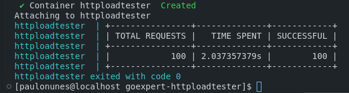
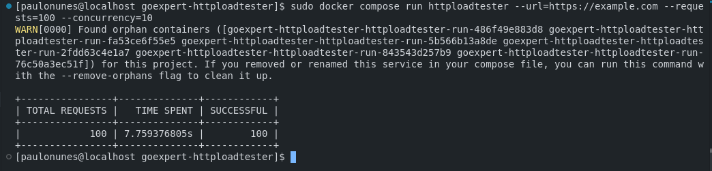
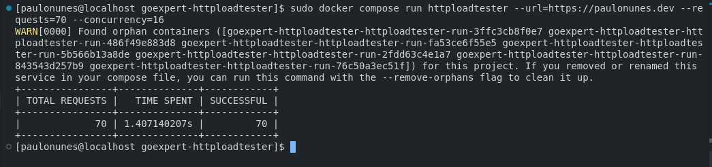
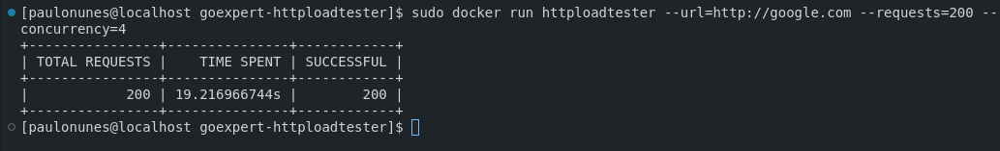
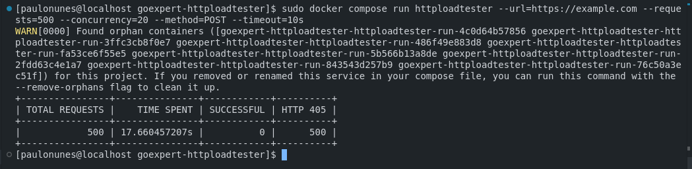
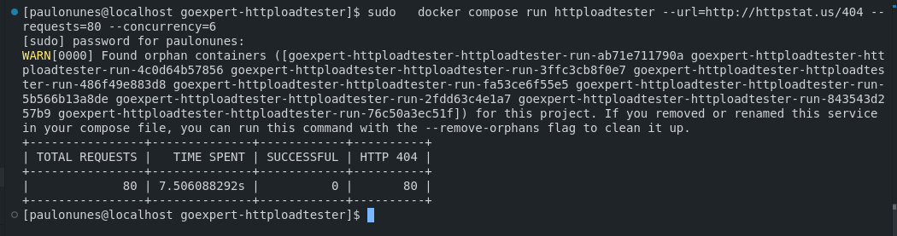
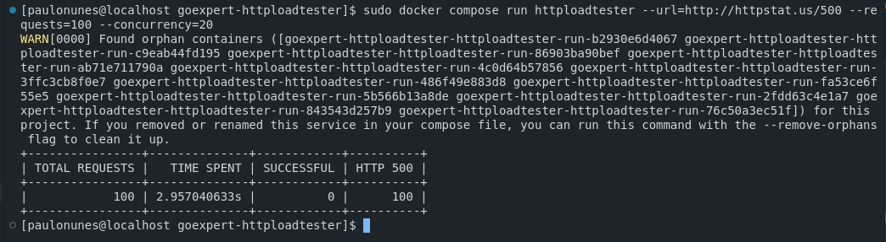

# HTTP Load Tester CLI 🚀

Sistema CLI em Go para realizar testes de carga em serviços web. O usuário pode especificar a URL do serviço, o número total de requisições e o nível de concorrência. Inclui relatórios detalhados após os testes. Desenvolvido por Paulo Nunes.

## Objetivo 🎯

O objetivo deste projeto é criar um sistema CLI em Go para realizar testes de carga em serviços web. O usuário fornece a URL do serviço, o número total de requisições e o número de chamadas simultâneas. Após os testes, o sistema gera um relatório detalhado com informações específicas da execução.

## Funcionalidades 📋

- **Configuração via linha de comando (parâmetros obrigatórios):**
  - URL do serviço (`--url`)
  - Total de requisições (`--requests`)
  - Concorrência (`--concurrency`)
- **Execução do teste:**
  - Realizar requisições HTTP para a URL especificada.
  - Distribuir os requests de acordo com o nível de concorrência definido.
  - Garantir que o número total de requests seja cumprido.
- **Relatórios detalhados:**
  - Tempo total de execução.
  - Total de requisições realizadas.
  - Quantidade de respostas com status HTTP 200.
  - Distribuição de outros códigos HTTP (404, 500, etc.).
- Flexível para execução via Docker, Podman, Docker Compose ou Podman Compose.

## Relatórios 📊

Após cada teste, o sistema gera um relatório com os seguintes dados:

- **Tempo total gasto na execução**: Quanto tempo levou para concluir todas as requisições.
- **Quantidade total de requisições realizadas**: Número total de requisições enviadas.
- **Quantidade de requisições com status HTTP 200**: Requisições bem-sucedidas.
- **Distribuição de outros códigos de status HTTP**: Contagem de códigos como 404, 500, etc.

---

### Como Executar 🚀

### Usando Docker Compose

1. Configure o arquivo `.env` com a URL desejada para o teste:

   ```
   TARGET_URL=https://example.com
   ```

2. Suba o serviço com:

   ```
   docker compose up --build
   ```

3. Para rodar o CLI com parâmetros personalizados, use:

   ```
   docker compose run httploadtester --url=https://paulonunes.dev --requests=70 --concurrency=16
   ```

### Executando com `docker run`

A aplicação também pode ser executada diretamente com o comando `docker run`:

```
docker image ls
docker run httploadtester --url=http://google.com --requests=200 --concurrency=4
```

Certifique-se de utilizar a imagem correta e que ela tenha sido buildada. 

---

### Evidências de Execução

#### **1. Teste Básico com 100 Requisições para um Site Existente**


Este teste foi configurado para enviar 100 requisições com uma URL válida. O resultado mostra:
- **Tempo total gasto**: 2 segundos aproximadamente.
- **Quantidade total de requisições realizadas**: 100.
- **Requisições bem-sucedidas**: 100 (100%).
  
**Conclusão**: O site respondeu de forma consistente e eficiente.

---

#### **2. Teste com Concorrência de 10 Requisições Simultâneas**


Configuração:
- **URL**: Site válido.
- **Requisições**: 100.
- **Concorrência**: 10.

Resultados:
- **Tempo total**: 7,7 segundos.
- **Requisições bem-sucedidas**: 100.

**Conclusão**: Mesmo com concorrência, o serviço respondeu de forma confiável.

---

#### **3. Teste com 70 Requisições em Alta Concorrência**


Configuração:
- **URL**: Site válido.
- **Requisições**: 70.
- **Concorrência**: 16.

Resultados:
- **Tempo total**: 1,4 segundos.
- **Requisições bem-sucedidas**: 70.

**Conclusão**: Alta taxa de concorrência reduz o tempo total sem afetar a taxa de sucesso.

---

#### **4. Teste com 200 Requisições e Baixa Concorrência**


Configuração:
- **URL**: Site válido.
- **Requisições**: 200.
- **Concorrência**: 4.

Resultados:
- **Tempo total**: 19 segundos.
- **Requisições bem-sucedidas**: 200.

**Conclusão**: Baixa concorrência aumenta o tempo de execução, mas todas as requisições foram bem-sucedidas.

---

#### **5. Teste com HTTP 405 (Método Não Permitido)**


Configuração:
- **URL**: Site que retorna 405.
- **Requisições**: 500.
- **Concorrência**: 20.
- **Método**: POST.

Resultados:
- **Tempo total**: 17,6 segundos.
- **Requisições bem-sucedidas**: 0.
- **HTTP 405**: 500.

**Conclusão**: Teste demonstrou a incapacidade do serviço de lidar com requisições POST, retornando erro para todas.

---

#### **6. Teste com HTTP 404 (Não Encontrado)**


Configuração:
- **URL**: `http://httpstat.us/404`.
- **Requisições**: 80.
- **Concorrência**: 6.

Resultados:
- **Tempo total**: 7,5 segundos.
- **Requisições bem-sucedidas**: 0.
- **HTTP 404**: 80.

**Conclusão**: Todas as requisições retornaram o status 404, indicando que o endpoint não existe.

---

#### **7. Teste com HTTP 500 (Erro Interno do Servidor)**


Configuração:
- **URL**: `http://httpstat.us/500`.
- **Requisições**: 100.
- **Concorrência**: 20.

Resultados:
- **Tempo total**: 2,9 segundos.
- **Requisições bem-sucedidas**: 0.
- **HTTP 500**: 100.

**Conclusão**: Todas as requisições falharam devido a erros internos do servidor.

---

## Estrutura do Projeto 📂

```
.
├── build
│   └── Dockerfile
├── cmd
│   └── root.go
├── docker-compose.yaml
├── go.mod
├── go.sum
├── internal
│   └── stresstest
│       ├── reports.go
│       ├── request.go
│       ├── request_test.go
│       ├── stress.go
│       ├── stress_test.go
│       ├── utils.go
│       └── utils_test.go
├── main.go
├── README.md
├── stress-test
└── .env
```

---

## Autor

**Paulo Henrique Nunes Vanderley**

- 🌐 [Site Pessoal](https://www.paulonunes.dev/)
- 🌐 [GitHub](https://github.com/paulnune)
- ✉️ Email: [paulo.nunes@live.de](mailto:paulo.nunes@live.de)
- 🚀 Aluno da Pós GoExpert 2024 pela FullCycle

## 🎉 Agradecimentos

Este projeto foi desenvolvido como parte de um desafio técnico, combinando aprendizado e prática com Go. 🚀